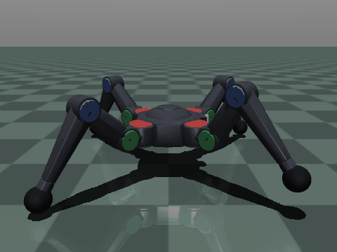
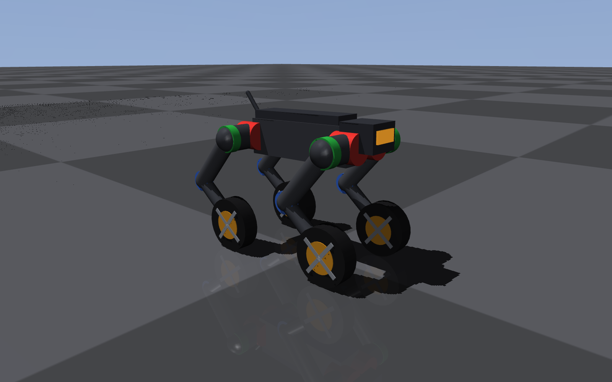
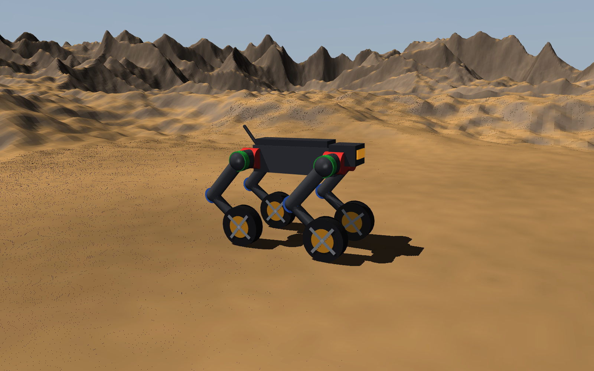

# Bestiary — legged robots built, trained, and documented in simulation

> 🚧 **Work in progress.** Functional and reproducible today, actively being
> polished. Expect frequent updates — issues and PRs welcome.

Custom legged robots authored as MuJoCo MJCF by generator scripts rather than
hand-written XML, trained with Soft Actor-Critic (Stable-Baselines3), and
written up as they go. Two machines so far — **Spyder**, a 12-DoF spider, and
**Hound**, a 16-DoF wheel-legged dog — plus **Whelp**, Hound's 2.3 kg printable
counterpart, which exists to answer the question simulation cannot: what
actually breaks. Plus the standard Gymnasium MuJoCo
benchmarks (`Ant-v5`, `Walker2d-v5`, `Humanoid-v5`) kept around as controls.

Three pointers before the pictures:

- [`research/`](research/) — what each run taught us, which decisions are
  settled, and what would reverse them. **The weights are disposable; that
  folder is not.**
- [`docs/lessons/`](docs/lessons/README.md) — start here if you are learning the
  field rather than following the project. One idea per page, from scratch, with
  the equation worked on a number this repo actually produced.
- [`ROADMAP.md`](ROADMAP.md) — where this is going next.

---

## The robots

### Spyder-v0 — custom 12-DoF spider

<p align="center">
  
  
</p>

<p align="center">
  <em><strong>Left:</strong> the trained 3.75M-step bounding run (eval 7,392).
  <strong>Right:</strong> a turntable of the Blender-authored shell — a procedural
  pose sweep, not a policy, showing the model the left-hand run is simulating.</em>
</p>

This repo's own environment: model in `assets/spyder12.xml`, env in
`envs/spyder.py`, Ant-style reward plus an upright-termination rule. Earlier
versions were reward-hacked twice — first a jump-to-termination exploit, then a
cartwheeling gait — and both fixes are written up as a postmortem in the
`envs/spyder.py` docstring. With the loopholes closed, SAC trained clean: an
upright 3.2 m/s walk by 400K steps, accelerating into a ~6.5 m/s bounding run by
3.75M with full 1000-step episodes.

The shell is modelled in Blender by `robots/spyder/build_mesh.py` and attached as
visual-only geoms (`contype=0 conaffinity=0 density=0`), so the capsules
underneath still carry every gram and every contact. `robots/spyder/check.py`
proves it: strip the shell out and `qpos`/`qvel`/`cfrc_ext` match bit-for-bit
over 2,000 contact-rich steps. Press `3` in the viewer to see the capsules.

> Viewing note: the floor's checker texture is only rendered over an 80×80 m
> patch (`size="40 40 40"` — collisions are infinite, rendering isn't). The
> spider outruns it mid-episode and later frames show a bare horizon. It is on
> the ground the whole time.

```bash
venv/bin/python -m bestiary.train.watch --run spyder_walk_v3
```

### Hound-v0 — custom 16-DoF wheel-legged dog · **currently being worked on**

<p align="center">
  
  
</p>

<p align="center">
  <em><strong>Left:</strong> <code>Hound-v0</code> on the plane.
  <strong>Right:</strong> the identical robot on the <code>HoundDesert-v0</code>
  heightfield — the terrain the spider already runs on.</em>
</p>

Four legs of four joints each — **abduction, hip, knee, and a driven wheel where
the foot would be**. Link lengths and masses are Unitree Go2's, read off
[MuJoCo Menagerie](https://github.com/google-deepmind/mujoco_menagerie), so the
mass distribution and torque limits describe a machine that could exist; the
wheel is ours, since no vendor ships a wheel-legged MJCF. 17.0 kg, stands at
0.363 m, 169-dim observation, 3.0 N·m at each wheel.

The models, the env and its checks are done. **Training is the active work, and
no result is published here until it clears this repo's ≥3-seed bar** — the
current runs and what they are testing live in [`research/`](research/).

```bash
venv/bin/python -m bestiary.robots.hound.build --report   # regenerate both models
venv/bin/python -m bestiary.robots.hound.check            # 38 assertions on the mechanics
```

### Benchmarks — Ant-v5, Walker2d-v5, Humanoid-v5

<p align="center">
  
  
</p>
<p align="center">
  
  
</p>

<p align="center">
  <em><strong>Top:</strong> Ant-v5 — default reward (converged to a two-legged
  gait) and foot-contact shaping (uses all four).
  <strong>Bottom:</strong> Walker2d-v5 and Humanoid-v5, both on the stock reward.</em>
</p>

The Ant pair is the point of this row. Stock `Ant-v5` rewards forward velocity
minus costs, plus a survival bonus — nothing in there says "use all four legs",
so SAC found a two-legged hop that maximizes it. `FootContactRewardWrapper`
(`rewards/shaping.py`) adds one term: count how many ankles touched ground in
the last 50 steps and penalize each idle leg. The baseline still scores higher in
raw reward because it never pays the penalty; the shaped run trades a little
velocity for a gait that actually looks quadrupedal.

Walker2d and Humanoid need no shaping and use the same hyperparameters: a biped
cannot move forward on a degenerate gait, so there is no local optimum to shape
away — Humanoid just needs more steps.

### Every trained policy

| Run | Env | Reward | Steps | Best eval | Gait |
| --- | --- | --- | --- | --- | --- |
| `spyder_walk_v3` | `Spyder-v0` | default (Ant-style + upright termination) | 3.75M | 7,392 | ~6.5 m/s four-legged bound |
| `baseline_2leg` | `Ant-v5` | default | 3.75M | 6,657 (unshaped) | two legs only |
| `foot_contact_v1` | `Ant-v5` | default + foot-contact penalty | 3.75M | 5,647 (shaped) | uses all four |
| `walker_baseline` | `Walker2d-v5` | default | 3.75M | 5,944 | upright 2-legged walk |
| `humanoid_baseline` | `Humanoid-v5` | default | 4M | 6,458 | upright 3D bipedal walk |

```bash
venv/bin/python -m bestiary.train.watch --run <name>            # best-eval checkpoint
venv/bin/python -m bestiary.train.watch --run <name> --latest   # most recent instead
```

---

## Install

```bash
python3.13 -m venv venv
venv/bin/pip install -r requirements.txt
venv/bin/pip install -e . --no-deps      # makes `bestiary` importable from anywhere
```

Python 3.13 · PyTorch 2.5.1 + CUDA 12.1 · Gymnasium 1.2 with MuJoCo 3.8 ·
Stable-Baselines3 2.8. GPU: NVIDIA GeForce RTX 2080.

> `requirements.txt` pins PyTorch against CUDA 12.1. For CPU-only or another
> CUDA version, drop the `--extra-index-url` line and follow
> <https://pytorch.org/get-started/locally/>.
>
> `--no-deps` is deliberate: every dependency is already pinned, and letting pip
> re-resolve them can silently move a version out from under a reproducible run.
>
> Call `venv/bin/python` directly rather than `source venv/bin/activate` — this
> venv was created elsewhere and moved, so `activate` exports a stale
> `VIRTUAL_ENV` and leaves no `python` on `PATH`.

## Quick start

`--env` is given **once**, at creation, and pinned in that run's `config.json`;
it defaults to `Ant-v5`. `--steps` is per-invocation, not a cumulative target.

```bash
# a fresh run
venv/bin/python -m bestiary.train.train --run-name my_baseline --seed 0 --steps 1_000_000

# a different environment — just pass --env once
venv/bin/python -m bestiary.train.train --run-name walker_baseline --env Walker2d-v5 --seed 0 --steps 1_000_000

# foot-contact reward shaping (Ant-only)
venv/bin/python -m bestiary.train.train --run-name my_shaped --seed 0 --steps 1_000_000 \
    --wrapper foot_contact \
    --wrapper-kwargs '{"penalty": 1.0, "window": 50, "contact_threshold": 1.0}'

# resume — env, wrapper and seed are read back from config.json
venv/bin/python -m bestiary.train.train --run-name walker_baseline --steps 2_000_000
```

> The foot-contact wrapper resolves four ankle geoms and raises at init on any
> other env. Baseline is the right choice for non-Ant envs anyway.

## What a run looks like on disk

```
runs/foot_contact_v1/
├── ant_sac.zip          # latest checkpoint — what a resume reads
├── ant_sac_best.zip     # best-ever eval policy — what watch.py loads
├── ant_sac_best.txt     # best-eval high-water mark, resume-safe
├── ant_buffer.pkl       # replay buffer (~2.6 GB, resume-only)
├── ant_tb/              # TensorBoard event files
├── videos/              # one MP4 per eval snapshot, named by global step
└── config.json          # env, wrapper, kwargs, seed, hyperparameters
```

`config.json` is the source of truth for what produced a run: on resume it
**overrides** any conflicting `--env` / `--wrapper` / `--seed` on the CLI, so you
cannot change the environment or reward semantics mid-run and contaminate a
replay buffer filled under different dynamics.

Two checkpoints, because RL policies can briefly degrade late in training: a
resumed run that goes worse costs you nothing, since `_best.zip` is only
overwritten when an eval actually beats the previous best. Every `--video-every`
steps (default 50,000) one greedy eval episode is written to `videos/` — play
them in order to watch the gait emerge.

## TensorBoard

```bash
venv/bin/tensorboard --logdir runs/     # then open http://localhost:6006
```

| Tag | What it means |
| --- | --- |
| `rollout/ep_rew_mean` | average episode return — the headline training curve |
| `rollout/ep_len_mean` | episode length; rises toward 1000 as the robot stops falling |
| `eval/mean_reward` | shaped return on the deterministic eval episode |
| `eval/base_reward` | **unshaped** reward — for apples-to-apples comparison across runs |
| `eval/mean_idle_legs` | avg legs with no recent ground contact (lower = better gait) |
| `train/actor_loss`, `train/critic_loss` | SAC actor and critic (Q) losses |
| `train/ent_coef` | auto-tuned entropy temperature α |

`eval/base_reward` and `eval/mean_idle_legs` only have data for runs that used a
wrapper — the baseline predates it.

## Repo layout

The library is an installable package under `src/`, so nothing depends on the
current working directory and there are no `sys.path` games.

| Path | Purpose |
| --- | --- |
| `src/bestiary/paths.py` | **every** filesystem path in the project resolves from here |
| `src/bestiary/train/` | `train.py` (train / resume SAC on any env), `watch.py` (render a run's policy) |
| `src/bestiary/envs/` | custom Gymnasium envs (`Spyder-v0`, `Hound-v0`, and their `*Desert-v0` variants); importing registers them |
| `src/bestiary/rewards/shaping.py` | reward-shaping wrappers and the `WRAPPERS` registry |
| `src/bestiary/terrain/` | generate the desert heightfield, read it back, hash the compiled one |
| `src/bestiary/robots/<name>/` | `build.py` (MJCF generator), `check.py` (assertions), `render.py` (figures) |
| `src/bestiary/robots/whelp/` | the one robot that is **hardware**: parametric OpenSCAD, a URDF for Isaac Lab, and a torque budget that says what will break — see [`CARD.md`](src/bestiary/robots/whelp/CARD.md) |
| `src/bestiary/guards/` | the lessons this project already paid for, as assertions |
| `research/` | learnings, decisions, episodes, and the append-only run ledger |
| `docs/lessons/`, `docs/theory/` | the teaching track, and the math written when it becomes load-bearing |
| `concepts/anvil/` | Blender concept art — runs under Blender's Python, not this package |
| `assets/` | **generated** output — model XMLs, meshes, terrain, figures, README media |
| `runs/<name>/` | one self-contained experiment; gitignored, tens of GB |

Model XMLs live in `assets/` and must stay there: MuJoCo resolves
`<mesh file="meshes/…">` and `<hfield file="terrain/…">` relative to the XML's
own directory. Robot folders hold source; `assets/` holds generated output.

## What to expect (SAC on Ant-v5, default reward)

| Steps | Behavior |
| --- | --- |
| 0 – 50k | random flailing, falls over constantly; returns near 0 |
| 50k – 150k | learns to stand, then shuffles; returns 500–1500 |
| 150k – 300k | a recognizable gait emerges; returns 2000–3500 |
| 300k – 500k | smoother gait; returns 3500–5500 |
| 1M+ | "solved" territory (~6000+) |

With foot-contact shaping the curve tracks the same shape but base reward grows
a little slower — the policy has to explore four-legged gaits before locking in.
