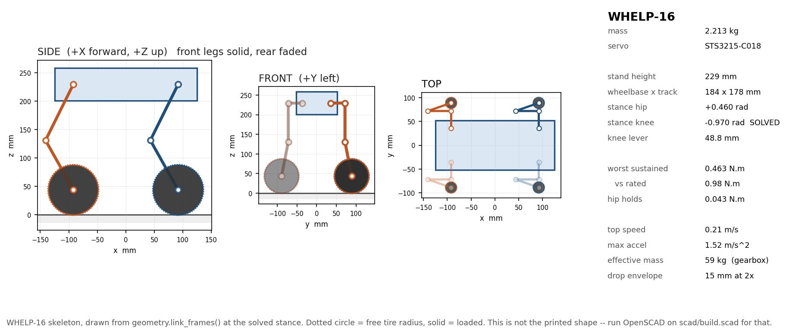

# Bestiary — legged robots built, trained, and documented in simulation

> 🚧 **Work in progress.** Functional and reproducible today, actively being
> polished. Expect frequent updates — issues and PRs welcome.

Legged robots authored as **code** — MJCF and URDF emitted by generator scripts,
never hand-written XML — and trained three ways: **SAC from scratch** in MuJoCo,
**PPO at scale** in Isaac Lab, and now **supervised next-token imitation** of a
recorded teacher. Three machines so far, plus the stock Gymnasium benchmarks as
controls. Everything is written up as it happens, failed runs included.

| | |
| --- | --- |
| [**`research/`**](research/) | what each run taught us, which decisions are settled, and what would reverse them. **The weights are disposable; that folder is not.** |
| [**`docs/lessons/`**](docs/lessons/README.md) | start here if you are learning the field rather than following the project. One idea per page, from scratch, with the equation worked on a number this repo produced. |
| [**`ROADMAP.md`**](ROADMAP.md) | where this is going next |

---

## The bestiary

### Spot, imitated — a 25.3M-parameter transformer that drives the robot
*Newest result, 2026-08-07.*

<p align="center">
  
</p>

<p align="center">
  <em>The command tour, one command at a time with a full stop between each:
  FORWARD · BACKWARD · SIDE-STEP LEFT/RIGHT · TURN LEFT/RIGHT · STOP.
  Nothing in the loop but the transformer: it reads the last 32 timesteps
  and emits the next 12 joint targets, 50 times a second.</em>
</p>

A pretrained flat-terrain walking policy was recorded in Isaac Sim — 1,038
episodes, 3.2 hours of `(observation, action)` tape at 50 Hz — rewritten as an
interleaved diary `o₀, a₀, o₁, a₁, …`, and a causal transformer trained from
scratch to predict the next entry. **No reward, no environment in the loop, no
exploration**: 11.5 minutes of plain supervised training to a best validation
loss of **0.0013**. Closed-loop on 12 held-out command scripts it survives
**12/12** and covers **7.223 m** against the teacher's **7.215 m**; the same
architecture with random weights falls within two seconds. Blind: 48
proprioceptive numbers in, 12 joint-position offsets out. An adversarial
refutation pass bounds what this shows — *walks from tapes*, not yet
*matches the teacher's gait* — details on the method page.

**Read more:** [the method on one page](research/NTP_STAGE1_METHOD.md) ·
[the dataset contract](research/SPOT_ROLLOUTS_SPEC.md) · code in
[`ntp/`](src/bestiary/ntp/), [`record_spot.py`](src/bestiary/isaac/record_spot.py),
[`play_ntp.py`](src/bestiary/isaac/play_ntp.py)

### Spyder-12 — the 12-DoF spider

<p align="center">
  
  
  
</p>

<p align="center">
  <em>SAC in MuJoCo (3.75M steps, eval 7,392) · PPO in Isaac Lab on the demo
  ramp · a turntable of the Blender-authored shell. The floor texture is only
  rendered over 80×80 m, so the spider outruns it — it is on the ground
  throughout.</em>
</p>

This repo's own environment. SAC was reward-hacked twice — a jump-to-termination
exploit, then a cartwheel — and with both loopholes closed it walks upright at
3.2 m/s by 400K steps and bounds at ~6.5 m/s by 3.75M. Ported to Isaac Lab and
trained with PPO it reaches 4–6 m/s in 1,500 iterations (147M steps, 39 minutes)
on a reward that is **forward velocity and nothing else** — no shaping, so what
it does is attributable to the stack rather than to a reward table. It reads no
command and holds no heading; steering is a separate arm.

**Read more:** [`envs/spyder.py`](src/bestiary/envs/spyder.py) — the
reward-hacking postmortem is in its docstring ·
[lesson 014, the anatomy of the Spyder policy](docs/lessons/014-anatomy-of-the-spyder-policy.md)

### Hound-16 — the 16-DoF wheel-legged dog

<p align="center">
  
  
</p>

<p align="center">
  <em><code>Hound-v0</code> on the plane, and the identical robot on the
  <code>HoundDesert-v0</code> heightfield.</em>
</p>

Four legs of four joints each — abduction, hip, knee, and **a driven wheel where
the foot would be**. Link lengths, masses and torque limits are Unitree Go2's,
read off [MuJoCo Menagerie](https://github.com/google-deepmind/mujoco_menagerie),
so the mass distribution describes a machine that could exist; the wheel is ours,
since no vendor ships a wheel-legged MJCF. 17.0 kg, stands at 0.363 m, 169-dim
observation, 3.0 N·m at each wheel. Models, env and a 38-assertion oracle are
done; **training is the active work, and no result is published here until it
clears this repo's ≥3-seed bar**.

**Read more:** [`CARD.md`](src/bestiary/robots/hound/CARD.md) — every dimension,
the solved stance, the spring sizing, and the traction budget that explains why
the hub motors are small

### Whelp-16 — the one that has to survive a floor

<p align="center">
  
</p>

Hound's printable sibling: the same topology in 2.21 kg of PETG and brass,
229 mm standing, on twelve hobby serial-bus servos. It exists to answer the
question simulation cannot — *what actually breaks*. Every number is derived
rather than estimated, and the derivations are unkind: 0.21 m/s top speed,
4.7 rad/s of joint rate against the ~30 rad/s published legged-RL configs assume,
and a drop envelope measured in millimetres because a 1:345 gearbox is a solid
block on a 40 ms impact.

**Read more:** [`CARD.md`](src/bestiary/robots/whelp/CARD.md) — the yield chain,
the material choice, the print rules, and the sim-to-real settings that fail
silently

### Controls — Ant-v5, Walker2d-v5, Humanoid-v5

<p align="center">
  
  
  
  
</p>

The Ant pair is the point of this row. Nothing in the stock reward says "use all
four legs", so SAC found a two-legged hop; `FootContactRewardWrapper`
([`rewards/shaping.py`](src/bestiary/rewards/shaping.py)) adds one term — count
the ankles that touched ground in the last 50 steps, penalise each idle leg — and
trades a little velocity for a gait that is actually quadrupedal. Walker2d and
Humanoid need no shaping: a biped has no degenerate gait to shape away.

---

## Every trained policy

| Run | Env | Reward | Steps | Best eval | Gait |
| --- | --- | --- | --- | --- | --- |
| `spyder_walk_v3` | `Spyder-v0` | default (Ant-style + upright termination) | 3.75M | 7,392 | ~6.5 m/s four-legged bound |
| `baseline_2leg` | `Ant-v5` | default | 3.75M | 6,657 (unshaped) | two legs only |
| `foot_contact_v1` | `Ant-v5` | default + foot-contact penalty | 3.75M | 5,647 (shaped) | uses all four |
| `walker_baseline` | `Walker2d-v5` | default | 3.75M | 5,944 | upright 2-legged walk |
| `humanoid_baseline` | `Humanoid-v5` | default | 4M | 6,458 | upright 3D bipedal walk |

```bash
venv/bin/python -m bestiary.train.watch --run <name>   # add --latest for the newest checkpoint
```

## Install

```bash
python3.13 -m venv venv
venv/bin/pip install -r requirements.txt
venv/bin/pip install -e . --no-deps      # makes `bestiary` importable from anywhere
```

Python 3.13 · PyTorch 2.5.1 + CUDA 12.1 · Gymnasium 1.2 with MuJoCo 3.8 ·
Stable-Baselines3 2.8. GPU: NVIDIA GeForce RTX 2080.

> For CPU-only or another CUDA version, drop the `--extra-index-url` line from
> `requirements.txt` and follow <https://pytorch.org/get-started/locally/>.
> `--no-deps` is deliberate: re-resolving pinned versions can silently move one
> out from under a reproducible run. Call `venv/bin/python` directly — this venv
> was created elsewhere and moved, so `source venv/bin/activate` exports a stale
> `VIRTUAL_ENV` and leaves no `python` on `PATH`.

## Quick start

`--env` is given **once**, at creation, and pinned in that run's `config.json`
(default `Ant-v5`). `--steps` is per-invocation, not a cumulative target.

```bash
# fresh run — --env once, then never again
venv/bin/python -m bestiary.train.train --run-name walker_baseline --env Walker2d-v5 --seed 0 --steps 1_000_000

# resume — env, wrapper and seed come back from config.json, which WINS on conflict
venv/bin/python -m bestiary.train.train --run-name walker_baseline --steps 2_000_000

# reward shaping (foot_contact is Ant-only)
venv/bin/python -m bestiary.train.train --run-name my_shaped --seed 0 --steps 1_000_000 \
    --wrapper foot_contact --wrapper-kwargs '{"penalty": 1.0, "window": 50, "contact_threshold": 1.0}'
```

## Repo layout

An installable package under `src/`, so nothing depends on the current working
directory and there are no `sys.path` games.

| Path | Purpose |
| --- | --- |
| `src/bestiary/paths.py` | **every** filesystem path in the project resolves from here |
| `src/bestiary/train/` | `train.py` (train / resume SAC on any env), `watch.py` (render a run's policy) |
| `src/bestiary/envs/` | custom Gymnasium envs (`Spyder-v0`, `Hound-v0`, their `*Desert-v0` variants); importing registers them |
| `src/bestiary/ntp/` | next-token imitation — data, model, training loop |
| `src/bestiary/isaac/` | Isaac Lab / Isaac Sim tasks, env configs, recording and playback |
| `src/bestiary/robots/<name>/` | `build.py` (MJCF generator), `check.py` (assertions), `CARD.md` |
| `src/bestiary/rewards/`, `terrain/`, `guards/` | shaping wrappers · heightfield generate/read/hash · the lessons already paid for, as assertions |
| `research/`, `docs/` | the record; the teaching track, and the math when it becomes load-bearing |
| `assets/` | **generated** output — model XMLs, meshes, terrain, figures, README media. They stay here: MuJoCo resolves `<mesh>` and `<hfield>` paths relative to the XML's own directory |
| `runs/<name>/` | one self-contained experiment; gitignored, tens of GB |

---

## Appendix — reading a SAC run

`runs/<name>/` holds the latest and best-eval checkpoints, the replay buffer
(~2.6 GB, resume-only), TensorBoard events, one eval MP4 per `--video-every`
steps, and `config.json` — which **overrides** any conflicting
`--env`/`--wrapper`/`--seed` on resume, so reward semantics cannot change mid-run
and contaminate a buffer filled under different dynamics. The full set of
invariants is in [`CLAUDE.md`](CLAUDE.md).

```bash
venv/bin/tensorboard --logdir runs/     # then open http://localhost:6006
```

| Tag | What it means |
| --- | --- |
| `rollout/ep_rew_mean` | average episode return — the headline training curve |
| `rollout/ep_len_mean` | episode length; rises toward 1000 as the robot stops falling |
| `eval/mean_reward` | shaped return on the deterministic eval episode |
| `eval/base_reward` | **unshaped** reward — for apples-to-apples comparison across runs |
| `eval/mean_idle_legs` | avg legs with no recent ground contact (lower = better gait) |
| `train/actor_loss`, `train/critic_loss` | SAC actor and critic (Q) losses |
| `train/ent_coef` | auto-tuned entropy temperature α |

`eval/base_reward` and `eval/mean_idle_legs` only have data for runs that used a
wrapper — the baseline predates them.

**Roughly what SAC on `Ant-v5` does**, default reward: flailing to 50k steps
(returns near 0); standing, then shuffling, to 150k (500–1500); a recognisable
gait by 300k (2000–3500); smoother by 500k (3500–5500); "solved" past 1M
(~6000+). Foot-contact shaping tracks the same curve with base reward growing a
little slower — the policy has to explore four-legged gaits first.
