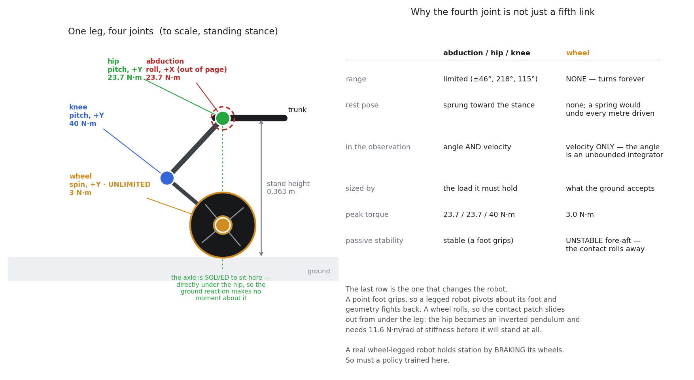
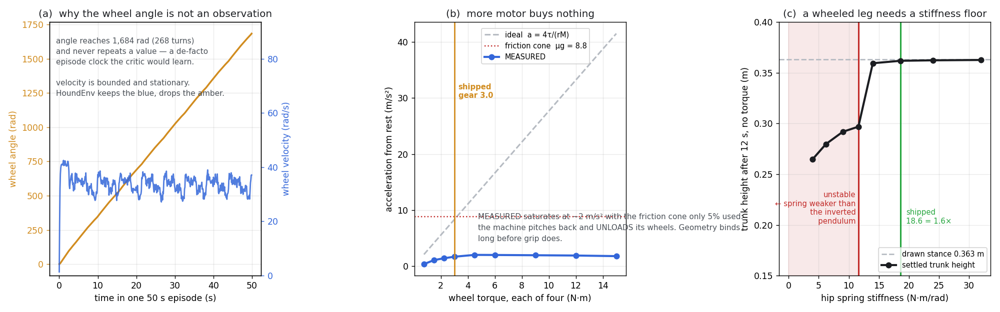

# MuJoCo locomotion with SAC (Stable-Baselines3 + MuJoCo)

> 🚧 **Work in progress.** Functional and reproducible today; actively being polished. Expect frequent updates — issues and PRs welcome.

Train Soft Actor-Critic agents on Gymnasium MuJoCo locomotion environments — `Ant-v5`, `Walker2d-v5`, `Humanoid-v5`, and friends — on GPU. Each experiment lives in its own directory under `runs/<run-name>/`, so different environments, reward shapings, seeds, and hyperparameter sweeps can coexist without clobbering each other. The environment is chosen per-run with `--env` and pinned in that run's `config.json`, so once a run is created you never re-specify it.

## Trained policies

### Ant-v5

<p align="center">
  
  &nbsp;&nbsp;
  
</p>

<p align="center">
  <em><strong>Left:</strong> baseline (default Ant-v5 reward) — converged to a two-legged gait.</em>
  &nbsp;&nbsp;
  <em><strong>Right:</strong> foot-contact reward shaping — uses all four legs.</em>
</p>

| Run | Reward function | Steps | Best eval return | Gait |
| --- | --- | --- | --- | --- |
| `baseline_2leg` | default Ant-v5 | 3.75M | 6,657 (unshaped) | two legs only |
| `foot_contact_v1` | default + foot-contact penalty | 3.75M | 5,647 (shaped) | uses all four |

The baseline scores higher in raw forward-velocity reward because it doesn't pay the shaping penalty, but it converged to a degenerate gait. The foot-contact run intentionally trades a bit of forward velocity for a four-legged gait that actually looks like quadrupedal locomotion. See [Why two trained policies?](#why-two-trained-policies) for the full story.

### Walker2d-v5

<p align="center">
  
</p>

<p align="center">
  <em>Baseline (default Walker2d-v5 reward) — a stable 2D walking gait.</em>
</p>

| Run | Reward function | Steps | Best eval return | Gait |
| --- | --- | --- | --- | --- |
| `walker_baseline` | default Walker2d-v5 | 3.75M | 5,944 | upright 2-legged walk |

The same SAC setup and hyperparameters that train Ant transfer directly to Walker2d — no reward shaping needed. A 2D biped can't move forward without using both legs, so there's no degenerate local optimum to shape away (which is why the foot-contact wrapper is Ant-only).

```bash
python watch.py --run walker_baseline   # watch this policy live
```

### Humanoid-v5

<p align="center">
  
</p>

<p align="center">
  <em>Baseline (default Humanoid-v5 reward) — an upright 3D bipedal walk.</em>
</p>

| Run | Reward function | Steps | Best eval return | Gait |
| --- | --- | --- | --- | --- |
| `humanoid_baseline` | default Humanoid-v5 | 4M | 6,458 | upright 3D bipedal walk |

Humanoid-v5 is the hardest of the three — a 17-DoF 3D biped with a ~350-dim observation — but the same SAC setup and hyperparameters that train Ant and Walker2d transfer directly, with no reward shaping. Like Walker2d, a biped can't move forward on a degenerate gait, so there's no local optimum to shape away; it just needs more steps to converge.

```bash
python watch.py --run humanoid_baseline   # watch this policy live
```

### Spyder-v0 (custom 12-DoF spider)

<p align="center">
  
  
</p>

<p align="center">
  <em>Left: the trained 3.75M-step bounding run (eval 7,392). Right: a turntable of the Blender-authored visual shell — a procedural pose sweep, not a policy, showing the model the left-hand run is actually simulating.</em>
</p>

| Run | Reward function | Steps | Best eval return | Gait |
| --- | --- | --- | --- | --- |
| `spyder_walk_v3` | Spyder-v0 default (Ant-style + upright termination) | 3.75M | 7,392 | fast four-legged bounding run |

Spyder-v0 is this repo's own environment: a 12-DoF spider (model in `assets/spyder12.xml`, env in `envs/spyder_env.py`) with an Ant-style reward plus an upright-termination rule. Earlier versions got reward-hacked twice — first a jump-to-termination exploit, then a cartwheeling gait — and the fixes are written up as a postmortem in the `envs/spyder_env.py` docstring. With both loopholes closed, SAC trained clean: an upright 3.2 m/s walk by 400K steps (eval 3,457), accelerating into a ~6.5 m/s bounding run by 3.75M (eval 7,392) with full 1000-step episodes.

The robot's shell is modelled in Blender by `make_spyder_mesh.py` (headless `bpy`, exports the OBJs in `assets/meshes/`) and attached as visual-only geoms — `contype=0 conaffinity=0 density=0`, so the capsules still carry every gram and every contact. `check_shell_physics.py` asserts that: it strips the shell out of the shipped MJCF and checks `qpos`/`qvel`/`cfrc_ext` match bit-for-bit over 2,000 contact-rich steps, so the appearance change can't invalidate a trained policy. Press `3` in the MuJoCo viewer to see the capsules underneath.

> Viewing note: the floor's checker texture is only rendered over an 80×80 m patch around the origin (`size="40 40 40"` on the plane geom — collisions are infinite, rendering isn't). The spider outruns it mid-episode, so late frames in the eval videos show it running against a bare horizon. It's on the ground the whole time.

```bash
python watch.py --run spyder_walk_v3   # watch this policy live
```

### Hound-v0 (custom 16-DoF wheel-legged dog) — model and env, no trained policy yet

<p align="center">
  
  
</p>

<p align="center">
  <em>Left: <code>Hound-v0</code> on the plane. Right: the identical robot on the
  <code>HoundDesert-v0</code> heightfield — the terrain the spider already runs on.
  No policy yet: these are the model, standing in its authored stance.</em>
</p>

A robot dog with **four legs of four joints each — abduction, hip, knee, and a
driven wheel where the foot would be**. Link lengths and link masses are Unitree
Go2's, read off [MuJoCo Menagerie](https://github.com/google-deepmind/mujoco_menagerie)
(Apache-2.0; the Unitree model is BSD-3), so the mass distribution and torque
limits are a machine that could exist. The wheel is ours: no vendor ships a
wheel-legged MJCF, so the fourth joint is designed here against the published
envelope of the wheeled quadrupeds that do exist (Unitree B2-W / Go2-W,
ANYbotics ANYmal-on-Wheels, Swiss-Mile).

| | |
| --- | --- |
| Actuated DoF | 16 — `4 x (abduct, hip, knee, wheel)`, plus 6 unactuated from the free joint |
| Observation | 169 (141 live + 28 reserved for commands / height scan) |
| Mass | 17.0 kg (Go2's 15.2 kg + 4 hub wheels) |
| Stands at | 0.363 m |
| Peak torque | 23.7 / 23.7 / 40 N·m at the leg joints, **3.0 N·m** at the wheel |
| Models | `assets/hound16.xml`, `assets/hound16_desert.xml` — both generated by `make_hound.py` |
| Env | `envs/hound_env.py` |

```bash
python make_hound.py --report   # regenerate both models, print the design budget
python check_hound.py -v        # 38 assertions on the mechanics, with the measurements
python render_hound.py          # the figures below
```

#### The leg

<p align="center">
  
</p>

Three of the four joints are the spider's under different names. The fourth is
a genuinely different kind of joint, and it changes the robot in three places:

- **It never stops.** The wheel hinge is `limited="false"`, so its angle is an
  unbounded integrator — 1,684 rad after a single 50-second episode, never
  repeating a value. Feed that to a policy and you have handed it an episode
  clock. `HoundEnv` therefore **drops the four wheel angles from the
  observation and keeps only their velocities**, which is the whole
  information content anyway: a cylinder is rotationally symmetric, so its
  absolute angle cannot affect the dynamics.
- **It has no rest pose.** The leg joints carry a spring toward the stance; a
  spring on a wheel would undo every metre driven.
- **It is sized by the ground, not the motor** — see below.

#### Three measurements that define the machine

<p align="center">
  
</p>

**(c) is the one that matters, and it is the deep difference between a wheel
and a foot.** A point foot grips: push a legged robot's shin and the contact
patch stays put, so the leg pivots about the *foot* and the geometry fights
back. A wheel rolls: the contact patch is free to slide out from under the
leg, so the leg pivots about its own *hip* with nothing resisting it. The
standing stance becomes an inverted pendulum, and there is a hard stiffness
floor below which the machine simply cannot stand —

```
stiffness > -N · d²h/dq²  =  11.6 N·m/rad
```

— which the plot finds empirically as a step at exactly that value. Below it
the robot slides into the splits and sits down; above it, it stands at the
height it was drawn at. Only the hip is affected: a wheel rolls fore-aft but
*grips* sideways, so abduction keeps its passive stability. The practical
consequence is that **a real wheel-legged robot holds station by braking its
wheels, and so must a policy trained here.**

**(b) corrects a claim the design started with.** `gear_wheel` is 3.0 N·m
because the friction cone caps a wheel carrying 4.25 kgf at 3.19 N·m. That
conclusion is right, but measurement shows it is right for the wrong reason:
thrust saturates at ~2 m/s², a quarter of the μg = 8.8 the friction cone would
allow, with the cone only 5% used. What actually binds is a **wheelie** — all
the thrust acts at ground level while the mass sits 0.363 m up on a 0.387 m
wheelbase, so past ~6 N·m every wheel lifts clear of the ground. Friction is
the upper bound; geometry is the real one.

#### Why the desert is the point

On flat ground the cheapest policy for this robot is to freeze all twelve leg
joints and spin the wheels — a skateboard, not a dog. That is not even wrong;
it is what a wheel-legged robot *should* do on a road, and `Hound-v0` will
probably look like that. It is only a failure on `HoundDesert-v0`, where a dune
the wheels cannot climb is the thing that makes legs worth using. **The terrain
is the shaping term** — which is what [ROADMAP](ROADMAP.md) Step 3 claims a
curriculum is for.

Two more suspects are written down in `envs/hound_env.py` *before* the first
run, deliberately: the spider's two reward hacks were both found the expensive
way, after the compute had been spent. Predicting them costs nothing and makes
the postmortem honest either way.

```bash
# smoke-tested to 150k on CPU (throwaway); the real run is not started
python train.py --run-name hound_desert_v0 --env HoundDesert-v0 --seed 0 --steps 2_000_000
```

## Install

```bash
python3.13 -m venv venv
source venv/bin/activate
pip install -r requirements.txt
```

> `requirements.txt` pins PyTorch 2.5.1 built against CUDA 12.1. For CPU-only or a different CUDA version, drop the `--extra-index-url` line and follow <https://pytorch.org/get-started/locally/>.

## Stack

- Python 3.13 (venv in `./venv`)
- PyTorch 2.5.1 + CUDA 12.1
- Gymnasium 1.2 with MuJoCo 3.8
- Stable-Baselines3 2.8

GPU: NVIDIA GeForce RTX 2080.

Activate the venv in every new terminal:

```bash
source venv/bin/activate
```

## Quick start

Watch either trained policy in a live MuJoCo window:

```bash
python watch.py --run baseline_2leg        # the two-legged baseline
python watch.py --run foot_contact_v1      # the four-legged shaped policy
```

Start a fresh experiment of your own. `--env` is given once, at creation, and defaults to `Ant-v5`:

```bash
# Ant baseline, default hyperparameters, 1M steps
python train.py --run-name my_baseline --seed 0 --steps 1_000_000

# A different environment — just pass --env once
python train.py --run-name walker_baseline --env Walker2d-v5 --seed 0 --steps 1_000_000
python train.py --run-name humanoid_baseline --env Humanoid-v5 --seed 0 --steps 2_000_000

# Foot-contact reward shaping (Ant-only — see note below)
python train.py --run-name my_shaped --seed 0 --steps 1_000_000 \
                --wrapper foot_contact \
                --wrapper-kwargs '{"penalty": 1.0, "window": 50, "contact_threshold": 1.0}'
```

Resume an interrupted run with the same `--run-name` — `--env`, wrapper, and seed are all read back from `config.json`, so you only pass `--steps`:

```bash
python train.py --run-name walker_baseline --steps 2_000_000
# env / wrapper / seed are read from runs/walker_baseline/config.json automatically
```

> **Note on the foot-contact wrapper:** it resolves four ankle geoms and only applies to `Ant-v5`. Don't pass `--wrapper foot_contact` on a 2-legged env like `Walker2d-v5` — it'll raise at init. Baseline (no wrapper) is the right choice for non-Ant envs anyway.

## Run directory layout

Each invocation of `train.py` writes everything under `runs/<run-name>/`:

```
runs/foot_contact_v1/
├── ant_sac.zip          # latest checkpoint — used to resume
├── ant_sac_best.zip     # best-ever eval policy — used by watch.py
├── ant_sac_best.txt     # best-eval reward (resume-safe high-water mark)
├── ant_buffer.pkl       # saved replay buffer (~1.7 GB)
├── ant_tb/              # TensorBoard event files
├── videos/              # one MP4 per eval snapshot
└── config.json          # wrapper, kwargs, seed, hparams that produced this run
```

`config.json` is the source of truth for what produced a run. On resume, it overrides whatever `--env`, `--wrapper`, or `--seed` you pass on the CLI — this is intentional, so you can't accidentally change the environment or reward semantics mid-run and contaminate the replay buffer.

## Two checkpoints per run

RL policies can briefly degrade late in training (catastrophic forgetting / temporary regression). Each run keeps two:

- **`ant_sac.zip`** is always overwritten with the latest model — this is what `train.py` reads to resume.
- **`ant_sac_best.zip`** is only overwritten when an eval beats the previous best — this is what `watch.py` loads by default. The high-water mark survives across runs via `ant_sac_best.txt`.

A resumed run that goes worse won't lose you anything: you can still watch your best-ever policy and keep training from the most recent state. Use `python watch.py --run <name> --latest` to override and watch the latest checkpoint instead of the best.

## Watch progress over time (videos)

Every `--video-every` env-steps (default 50,000), `train.py` rolls one greedy eval episode and writes an MP4 to `runs/<run-name>/videos/`, named by global step:

```
runs/foot_contact_v1/videos/eval_step_000050000.mp4
runs/foot_contact_v1/videos/eval_step_000100000.mp4
...
runs/foot_contact_v1/videos/eval_step_003750000.mp4
```

Open the folder and play them in order to literally see the ant evolve from random flailing into a smooth gait.

## TensorBoard

In a second terminal, point TensorBoard at all runs to compare them side-by-side:

```bash
source venv/bin/activate
tensorboard --logdir runs/
```

Open <http://localhost:6006>. Key metrics:

| Tag                       | What it means                                          |
| ------------------------- | ------------------------------------------------------ |
| `rollout/ep_rew_mean`     | average episode return — the headline training curve   |
| `rollout/ep_len_mean`     | episode length; rises to 1000 as the ant stops falling |
| `eval/mean_reward`        | shaped return on the deterministic eval episode        |
| `eval/base_reward`        | **unshaped** Ant-v5 reward — for apples-to-apples comparison across runs |
| `eval/mean_idle_legs`     | avg legs with no recent ground contact (lower = better quadrupedal gait) |
| `eval/best_mean_reward`   | high-water mark for the run                            |
| `train/actor_loss`        | SAC actor loss                                         |
| `train/critic_loss`       | SAC critic (Q) loss                                    |
| `train/ent_coef`          | auto-tuned entropy temperature α                       |

`eval/base_reward` and `eval/mean_idle_legs` only have data for runs that used a wrapper — the baseline didn't log them because the wrapper didn't exist yet.

## Why two trained policies?

The baseline run (`baseline_2leg`) optimized the stock Ant-v5 reward: forward velocity, minus control cost, minus contact cost, plus a survival bonus. None of those terms encode "use all four legs" — they only encode "move forward without falling". SAC duly found a two-legged hopping gait that maximizes that reward function. It works, but it doesn't look like a quadruped.

The shaped run (`foot_contact_v1`) adds one extra term: for each step, count how many ankles have made ground contact in the last 50 steps, and penalize the agent for each leg that hasn't. The penalty is small (1.0 per idle leg per step) but consistent, so policies that drag two legs are strictly worse than policies that use all four. The forward-velocity term still does the heavy lifting; the wrapper just removes one bad local optimum from the optimization landscape.

The wrapper lives in `wrappers.py` as `FootContactRewardWrapper` and is registered in the `WRAPPERS` dict so any new reward-shaping idea can be added in one place.

## Files

| File | Purpose |
| --- | --- |
| `train.py` | train / resume SAC on any MuJoCo env (per-run `--env`, output dir, optional wrapper) |
| `watch.py` | render a chosen run's best policy in a window (env read from its `config.json`) |
| `wrappers.py` | reward-shaping wrappers (currently `FootContactRewardWrapper`, Ant-only) and the `WRAPPERS` registry |
| `envs/` | custom Gymnasium environments (`Spyder-v0`, `Hound-v0`, and their `*Desert-v0` variants) — `import envs` registers them, which `train.py`/`watch.py` do automatically |
| `envs/terrain.py` | shared heightfield lookup used by both terrain envs |
| `make_hound.py` | generate `assets/hound16*.xml` from one `Spec`; `--report` prints the design budget |
| `check_hound.py` | 38 assertions on the hound's mechanics, with the measurements behind them |
| `render_hound.py` | the hound's preview renders, leg diagram and mechanics figures |
| `make_terrain.py` | generate the desert heightfield + ground texture |
| `runs/<name>/` | one self-contained experiment — model, buffer, TB logs, videos, config |
| `assets/` | GIFs used by this README |

## What to expect (SAC on Ant-v5, default reward)

| Steps      | Behavior                                                  |
| ---------- | --------------------------------------------------------- |
| 0 – 50k    | Random flailing, falls over constantly. Returns near 0.   |
| 50k – 150k | Learns to stand, then awkward shuffling. Returns 500–1500.|
| 150k – 300k| A recognizable gait emerges. Returns 2000–3500.           |
| 300k – 500k| Smoother gait. Returns 3500–5500.                         |
| 1M+        | "Solved" territory (~6000+).                              |

With foot-contact shaping, the curves track the same shape but base reward grows a bit slower — the policy is forced to explore four-legged gaits before locking in a strategy.
